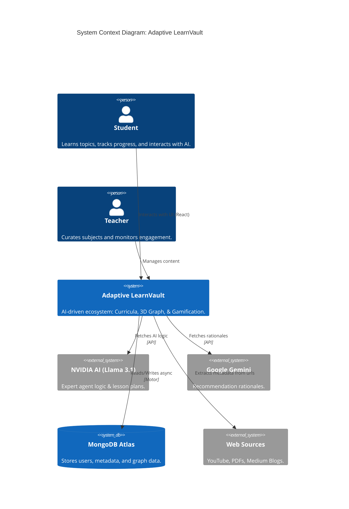

# C4 Context: Adaptive LearnVault - System Documentation

This document provides the high-level System Context for **Adaptive LearnVault**, following the C4 Model. It is designed to provide full project-specific context for LLM agents, developers, and stakeholders.

---

## 1. System Overview

### Short Description
An AI-driven personal academic tutor and curriculum architect that transforms fragmented web resources into structured, gamified learning paths with a 3D Knowledge Graph.

### Long Description
Adaptive LearnVault is a multi-tier learning ecosystem that solves the "information overload" problem for students. It leverages asynchronous NoSQL architecture (MongoDB) and Large Language Models (NVIDIA Llama 3.1 70B & Google Gemini) to automate resource organization. The system extracts metadata (difficulty, duration) from URLs, generates adaptive curricula, and visualizes conceptual relationships in an interactive 3D Knowledge Graph. It incorporates high-fidelity gamification (XP, Levels, Streaks) to maintain user engagement and provide an evidence-based roadmap for mastering complex subjects.

---

## 2. Personas

### Student (Core Learner)
- **Type**: Human User
- **Description**: Individuals looking to master a specific subject or organize their research.
- **Goals**: Obtain structured roadmaps, clear doubts using AI, and track progress via gamified feedback.
- **Key Features Used**: AI Agent (Chat), Dashboard (Stats), 3D Graph, Recommendation Engine.

### Teacher / Content Curator
- **Type**: Human User
- **Description**: Educational experts who provide curated lists or verify AI-generated metadata.
- **Goals**: Organize resources for students and monitor group engagement.
- **Key Features Used**: Content Management, Topic Management.

### LearnVault AI (Agentic Persona)
- **Type**: Programmatic User / AI Assistant
- **Description**: An elite curriculum architect powered by NVIDIA/Llama-3.1-70B.
- **Goals**: Generate lesson plans, simplify concepts using analogies, and breakdown high-weightage exam areas.
- **Key Features Used**: Chat API, Context Window Management.

---

## 3. System Features

### AI Learning Agent
- **Description**: A personal tutor that generates structured lesson plans (Foundations, Core, Advanced), clears doubts with analogies, and provides technical deep-dives.
- **Users**: Student, Teacher.

### 3D Knowledge Graph
- **Description**: An interactive visualization of concepts and their dependencies. Each node represents a topic, and edges represent prerequisites or relatedness.
- **Users**: Student.

### Adaptive Recommendation Engine
- **Description**: Dynamically calculates "Content-to-User Fit" based on difficulty proximity. Provides an AI rationale for *why* a specific piece of content is recommended next.
- **Users**: Student.

### Gamified Progress Vault
- **Description**: Tracks real-time XP gains based on Difficulty and Duration. Manages streaks, daily goals, and cumulative completion rates across different topics.
- **Users**: Student.

---

## 4. User Journeys

### The "New Subject" Journey
1. **Initiation**: Student asks the AI Agent "I want to learn Quantum Computing for my exam."
2. **Analysis**: AI Agent breaks the topic into units (Chapters) with important formulas and theorems.
3. **Roadmap**: AI generates a 6-week study plan with estimated time per phase.
4. **Integration**: Relevant resources are pulled from the DBMS and recommended based on the student's level (Beginner).

### The "Daily Progress" Journey
1. **Check-in**: Student views the Dashboard to see their current Streak (e.g., 5 days) and Daily Goal (e.g., 60 mins).
2. **Engagement**: Student interacts with a recommended Video/Blog.
3. **Recording**: Upon completion, the system updates `UserContentStatus` and increments `weekly_hours` in `UserActivity`.
4. **Reward**: XP is awarded, potentially triggering a Level Up or a goal completion notification.

---

## 5. External Systems and Dependencies

### MongoDB Atlas
- **Type**: NoSQL Database
- **Description**: Primary cloud storage for users, content, graph nodes, and activity logs.
- **Integration**: Async Motor driver (FastAPI).

### NVIDIA API Catalog (Llama 3.1 70B)
- **Type**: LLM Provider
- **Description**: Powers the "LearnVault AI" agent for curriculum generation and doubt clearing.
- **Integration**: Async OpenAI-compatible API client.

### Google Gemini API
- **Type**: LLM Provider
- **Description**: Used specifically for generating personalized "Why learn this?" rationales in the recommendation engine.
- **Integration**: GenerativeAI Python SDK.

### Web Content Sources (YouTube/Medium)
- **Type**: External Data Source
- **Description**: Provides the core learning materials that the system scrapes/indexes.
- **Integration**: URL Parsers / Metadata Extractors.

---

## 6. System Context Diagram

---

## 7. Technical Context Summary (For Gemini Export)

- **Architecture**: Asynchronous REST API (FastAPI) + React SPA.
- **Data Persistence**: MongoDB (NoSQL) for high-performance metadata agility.
- **Security**: Stateless JWT-based authentication; focus on rapid developer iteration.
- **Gamification Logic**: `Difficulty * Duration` based XP scaling; atomic incrementing of weekly activity arrays.
- **Visualization**: Three.js-based 3D Force-Directed Graph reflecting DBMS node/edge relationships.
